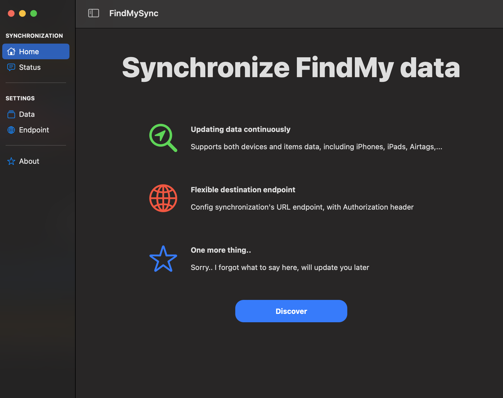

  

    <h3>
      <b>
        FindMySync
      </b>
    </h3>
  

  

    <b>
      Synchronize Apple FindMy data with Remote server
    </b>
  

  

  

   
  

  

  
<b>Table of contents</b>

---

- [Features](#features)
- [Usage](#usage)
- [Contributing](#contributing)
- [Changelog](#changelog)
- [License](#license)

---

## **Homepage**

## **Features**

- Supports both devices and items data, including iPhones, iPads, Airtags,...
- Synchronize data with a custom endpoint, with Authorization header
- Support macOS Catalina 10.15 - Ventura 13.4
- ...

**To suggest anything, please join our [Discussion board](https://github.com/MartinPham/FindMySync/discussions).**

## **Usage**
Check here [martinpham.com/findmysync](https://www.martinpham.com/findmysync/).

## **Contributing**

Please contribute using [GitHub Flow](https://guides.github.com/introduction/flow). Create a branch, add commits, and then [open a pull request](https://github.com/MartinPham/FindMySync/compare).

## **License**

This project is licensed under the [GNU General Public License v3.0](https://opensource.org/licenses/gpl-3.0.html) - see the [`LICENSE`](LICENSE) file for details.